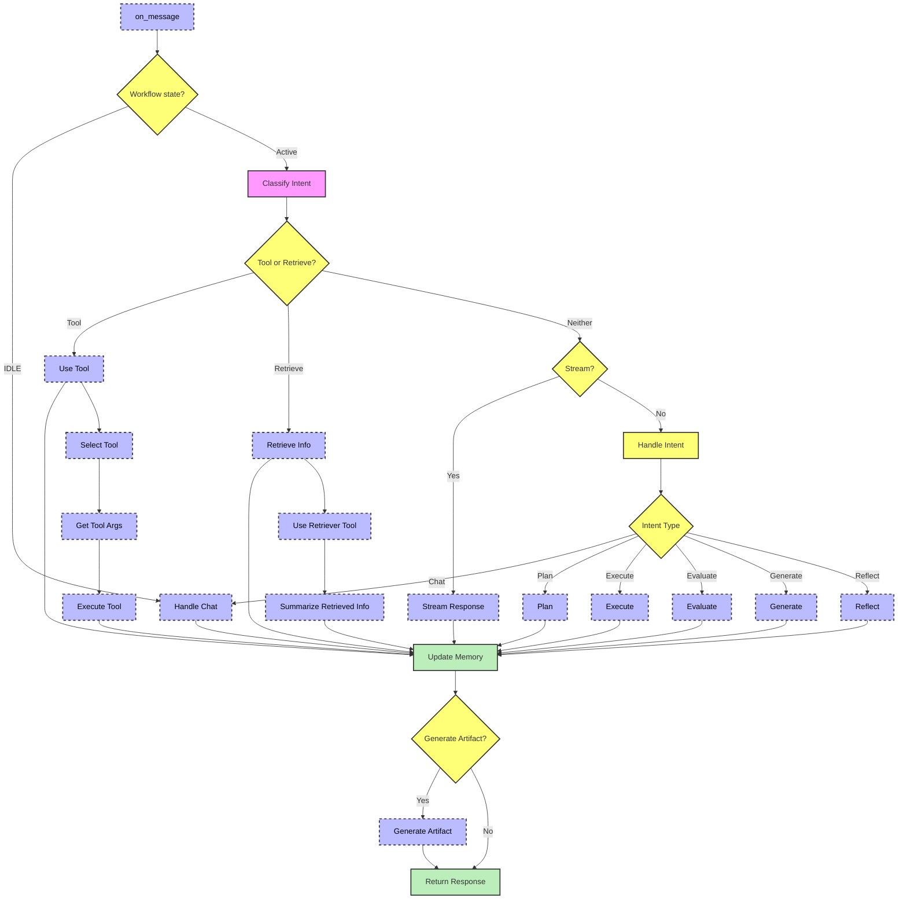

# **Conversational Agents** | *Very Experimental*

New in <samp>zyx</samp> is a newly created multi-agent framework, with support for tools, planning, supervision and more. </br>

- This framework follows the <samp>zyx</samp> architecture, and is built on top of the <code>LiteLLM</code> & <code>Instructor</code> completion module. </br>
- This framework presents a new way of looking at a multi-agent system, to be used as a state managed, conversational orchestration. </br></br>

### **Current Features**:

    - ***LLM Based Intent Classification***
    - ***Dynamically Generated Workflows & Tasks***
    - ***Artifact Generation & Guidance (Inspired by Claude)***
    - ***Custom Tool Usage***
    - ***Dynamic Short-Term Memory Management***
    - ***Supervision of Workflows***
    - ***Reflective Analysis of Tools & Workflows***

### **Planned Features**:

    - ***Long-Term Memory Management (Enter Old Workflows)***
    - ***Add More 'Worker Agents'***
    - ***Graph Based Tool Classification (To allow 'unlimited' tools) (Very Soon)***
    - ***Chat Response Customization (Very Soon)***

**Additional & Complex Customization and Modularity will be introduced in time, dont worry.**</br></br>

***Below is a high level flowchart of the implementation of this framework.***



## ***Why Conversational Agents?***

Creating conversational agents, with an ability to save complex state & workflows, allows for an organic way of interacting with LLMs. Currently, most agentic frameworks are focused on single or few shot workflows, diminishing the customization or tweakable ability of the user's desired outcome.

## **Creating the Agentic Workflow**

Lets create an agentic pipeline. </br>

Tools can be added in two ways, either by the <code>tools=[]</code> argument, or with the optimized <code>retriever_tools=[]</code> argument if tools are retrievers, query engines, etc.

```python
import zyx

# Create the workflow
agents = zyx.Agents(
    model="gpt-4o-mini",
    # Lets use some prebuilt zyx tools
    tools=[
        zyx.tools.execute_code,  # Code Executor
        zyx.tools.write_file,  # File Writer
    ],
    verbose=True
)
```

```bash
# OUTPUT
2024-09-08 02:04:12.779 | INFO     | zyx._client.memory:_create_collection:73 - Collection 'agents_memory' does not exist. Creating it now.
2024-09-08 02:04:12.779 | INFO     | zyx._client.memory:_create_collection:82 - Collection 'agents_memory' created successfully.
```

## **Sending a Message**

Messages will run through an intent classification step, to determine the next action. This allows for the creation of <code>Artifacts</code> & <code>Dynamic Workflows</code>.

```python
response = agents.completion("Hi")

print(response)
```

```bash
2024-09-08 02:04:13.801 | INFO     | zyx._client.memory:add:156 - Successfully added 1 points to the collection.
2024-09-08 02:04:14.667 | INFO     | zyx._client.memory:add:156 - Successfully added 1 points to the collection.

Hello! How can I assist you today?
```

> The response was short and simple, as it was classified as a simple chat intent. Lets start asking the agents to help us write some code.

## **Creating Goals & Artifacts**

Goals are optimized towards the type of tools presented to the agents. The framework will reason differently based on the toolset it has access to. 

> In a soon update, the concept behind contextual memory will be implemented for tools, allowing 'infinite' tools to be used.

```python
response = agents.completion(
    "I want to start writing an HTML page, that has a nice title in a box."
)

print(response)
```

**An artifact file was created for us, with our newly created HTML code. Lets view the file.**

<!DOCTYPE html>
<html lang="en">
<head>
    <meta charset="UTF-8">
    <meta name="viewport" content="width=device-width, initial-scale=1.0">
    <title>My Nice Title</title>
    <style>
        .title-box_0 {
            border: 2px solid #000;
            padding: 20px;
            text-align: center;
            font-size: 24px;
            background-color: #f0f0f0;
        }
    </style>
</head>
<body>
    <div class="title-box_0">
        My Nice Title
    </div>
</body>
</html>

## **Artifact Reflection & Regeneration**

Lets change the color of our artifact.

```python
response = agents.completion("Make the title red")

print(response)
```

Now lets view the file again.

<!DOCTYPE html>
<html lang="en">
<head>
    <meta charset="UTF-8">
    <meta name="viewport" content="width=device-width, initial-scale=1.0">
    <title>My Nice Title</title>
    <style>
        .title-box_1 {
            border: 2px solid #000;
            padding: 20px;
            text-align: center;
            font-size: 24px;
            background-color: #f0f0f0;
            color: red;
        }
    </style>
</head>
<body>
    <div class="title-box_1">
        My Nice Title
    </div>
</body>
</html>

The agentic framework was able to capture our intent and reflect the changes in our artfiact. This is a specific example, and the framework will adapt to the specific list of tools presented to it.

## **Lets Change the Topic**

```python
response = agents.completion("I want to get started learning python")

print(response)
```

```bash
2024-09-08 05:34:36.361 | INFO     | zyx._client.memory:add:156 - Successfully added 1 points to the collection.
2024-09-08 05:34:41.562 | INFO     | zyx._client.memory:add:156 - Successfully added 1 points to the collection.
To get started learning Python, you can follow these steps:

1. **Install Python**: Download and install the latest version of Python from the official website 
(https://www.python.org/downloads/).

2. **Set Up an IDE**: Choose an Integrated Development Environment (IDE) to write your code. Popular options 
include PyCharm, Visual Studio Code, or even simple text editors like Sublime Text.

3. **Learn the Basics**: Familiarize yourself with the basic syntax, data types, and control structures in Python. 
Resources like "Automate the Boring Stuff with Python" and Codecademy's Python course are great starting points.

4. **Practice Coding**: Start solving problems on platforms like LeetCode, HackerRank, or Codewars to improve your 
coding skills.

5. **Build Projects**: Work on small projects that interest you, such as a calculator, web scraper, or simple game,
to apply what you've learned.

6. **Join a Community**: Engage with other learners by joining forums like Stack Overflow or Reddit's r/learnpython
to ask questions and share knowledge.

7. **Explore Advanced Topics**: Once you're comfortable with the basics, explore more advanced topics like web 
development with Flask or Django, data analysis with Pandas, or machine learning with TensorFlow.

Remember, practice and consistency are key to becoming proficient in Python!
```

## **Now lets go back to our original artifact**

> We'll send a broad message, to test the agent.

```python
response = agents.completion("Change the title to blue and name is 'My Website!'")

print(response)
```

Lets view the file again.

<!DOCTYPE html>
<html lang="en">
<head>
    <meta charset="UTF-8">
    <meta name="viewport" content="width=device-width, initial-scale=1.0">
    <title>My Website!</title>
    <style>
        .title-box_2 {
            border: 2px solid #000;
            padding: 20px;
            text-align: center;
            font-size: 24px;
            background-color: #f0f0f0;
            color: blue;
        }
    </style>
</head>
<body>
    <div class="title-box_2">
        My Website!
    </div>
</body>
</html>

## **API Reference**

::: zyx._client.agents.Agents