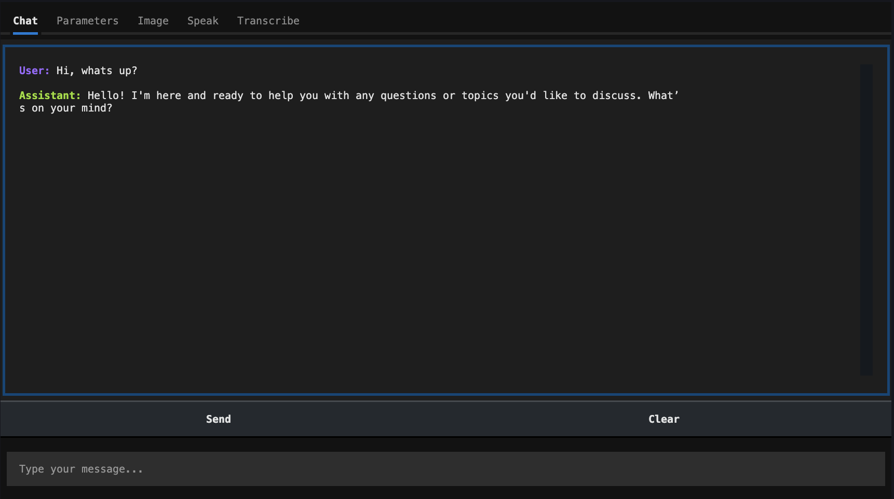

# **Getting Started**

Install the package with pip:

```bash
pip install zyx --upgrade
```

## **CLI App**

Test your <code>zyx</code> installation by running the super quick CLI model hub application, built on <code>Textual</code>. </br>

***Run the following code in your terminal***

```bash
zyx
```




