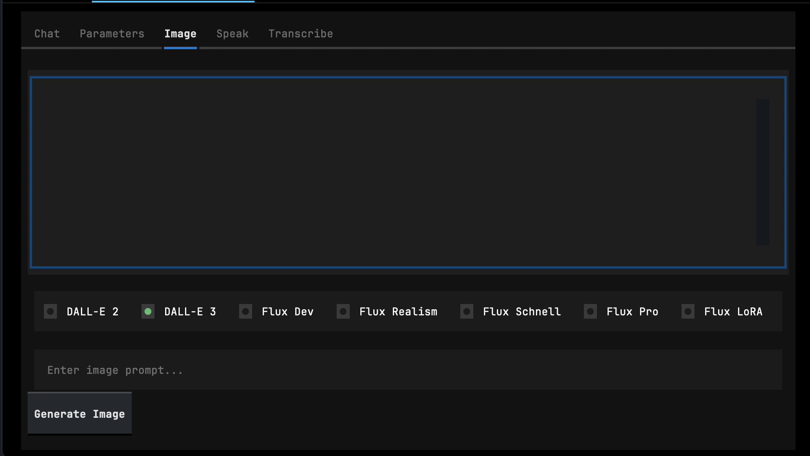

# *zyx*

> A *hyperfast, multi-modal, ease of use, developer-focused **GenAI toolkit.*** </br>
> Built with the sole purpose of providing one of the easiest API's and abstractions for working with LLMs, **zyx** works using lazy importing & import injection to bring the entire library into one very quick import.

---

```bash
# Quick Start
pip install zyx

zyx --model gpt-4o-mini
```

---

# **No Fancy Docs; But here's how to use it! (In a nutshell)**

> All examples will soon be available in this [Jupyter Notebook](./notebooks/getting-started.ipynb)

**Table of Contents**

- [Getting Started](#getting-started)
- [Core Concepts](#core-concepts)
    - [Generative model hub straight from your CLI](#generative-model-hub-straight-from-your-cli)
- [Unified Interface for LLM Completions](#unified-interface-for-llm-completions)
    - [Basic LLM Completion](#basic-llm-completion)
    - [Pydantic Outputs](#pydantic-outputs)
    - [Tool Calling & Execution](#tool-calling--execution)
- [RAG (Retrieval Augmented Generation)](#rag-retrieval-augmented-generation)
- [LLM-Powered Functions](#llm-powered-functions)
    - [Create working, generative, usable Python Functions.](#create-working-generative-usable-python-functions)
    - [Create Synthetic Data Easily](#create-synthetic-data-easily)
    - [Extract Information From Text](#extract-information-from-text)
    - [Create Custom LLM-Powered Functions](#create-custom-llm-powered-functions)
- [Multimodal Generation](#multimodal-generation)
    - [Image Generation](#image-generation)
    - [Text-to-Speech](#text-to-speech)
    - [Speech-to-Text](#speech-to-text)
- [CrewAI Based Agents (Experimental)](#crewai-based-agents-experimental)


### **Getting Started**

Install zyx through Pypi:

```bash
pip install zyx
```

> [!NOTE]
> The agentic pipeline is now built on top of CrewAI, and must be installed separately. CrewAI is relatively chunky, so its been kept out of the base library. You can install the zyx agents with the command below:
> ```bash
> pip install 'zyx[agents]'
> ```

</br>

## **Core Concepts**

### **Generative model hub straight from your CLI**




Use chat, image, or audio models right from your CLI. With optional, built in support for:
- **Chat Completions**  with any LiteLLM Model (*Supports all .completion() parameters*)
- **Optional Chat Instructions**
- **Image Generation** (OpenAI, Huggingface, & FAL_AI API's)
- **Voice Recording** for Speech-to-Text
- **Text-to-Speech**

</br>

```bash
# Launch (From your terminal)
zyx

# Launch with a custom chat model 
zyx --model 'ollama/llama3.1'
```

Optionally, if you just want to chat with a model; you can use the following command to launch a simple chat UI.

```bash
# Launch (From your terminal)
zyx-chat

zyx-chat --model <model_name> --temperature 0.3 --max_tokens 300
```

```python
# Or from your python script
import zyx

zyx.chat()

zyx.app()
```
---

## **Unified Interface for LLM Completions**

> **zyx.completion()**

Zyx builds upon **LiteLLM** & **Instructor** to provide a simple, yet powerful interface for working with LLMs. 
- Supports all LiteLLM Models
- **Structured Pydantic Outputs**
- **Tool Calling & Optional Tool Execution**

### **Basic LLM Completion**

```python
import zyx

# This returns a ModelResponse Object.
response = zyx.completion("How are you?")

# This is the raw response object.
print(response)
```
```bash
# OUTPUT
ModelResponse(
    id='chatcmpl-A1izD0plfDZr0e23nypO3ylkgMVIK',
    choices=[
        Choices(
            finish_reason='stop',
            index=0,
            message=Message(
                content="I'm just a computer program, so I don't have feelings, but I'm here and ready to help you!
How can I assist you today?",
                role='assistant',
                tool_calls=None,
                function_call=None
            )
        )
    ],
    created=1724974619,
    model='gpt-4o-mini-2024-07-18',
    object='chat.completion',
    system_fingerprint='fp_f33667828e',
    usage=Usage(completion_tokens=28, prompt_tokens=11, total_tokens=39),
    service_tier=None
)
```

```python
# Print out just the content
print(response.choices[0].message.content)
```
```bash
# OUTPUT
I'm just a computer program, so I don't have feelings, but I'm here and ready to help you!
How can I assist you today?
```

### **Pydantic Outputs**

```python
import zyx

# Pydantic Models easily accessible as well.
class Person(zyx.BaseModel):
    name: str
    age: int

zyx.completion(
    messages = "Who is Spider-Man?",

    # Lets use a custom model here.
    model = "ollama/llama3.1",
    
    # Pass the response model the same way you normally do.
    response_model = Person,
    
    # Change instructor modes straight from here!. Ollama models have better accuracy with md_json.
    mode = "md_json",
)
```
```bash
# OUTPUT
Person(name='Peter Parker', age=18)
```

### **Tool Calling & Execution**

The **'zyx.completion()'** function also supports tool execution when calling tools. Lets try creating a custom tool to search the web for us.

```bash
# Install the Duckduckgo-Search package; for web search
pip install duckduckgo-search
```

```python
# First lets create a tool to search the web for us.
from duckduckgo_search import DDGS

def search_web(query : str):
    """Searches the web for the given query"""
    return DDGS().text(query)
```

```python
# Now we can use this tool to search the web!
import zyx


response = zyx.completion(
    messages = "Who won the 2024 Euro cup final?",

    tools = [search_web],

    run_tools = True, # This defaults to false; & returns just the tool call response, if any.
    # If set to true; the tool will be executed, & the LLM will send another response with the tool's response.
)

print(response.choices[0].message.content)
```
```bash
# OUTPUT
Spain won the 2024 Euro Cup final, defeating England 2-1. The match took place on July 14, 2024, in Berlin. Spain's
victory marked a historic moment as they secured their fourth European Championship title. Mikel Oyarzabal scored 
the dramatic winning goal in the 86th minute. For more details, you can read the full article 
(https://edition.cnn.com/2024/07/14/sport/spain-england-euro-2024-final-spt-intl/index.html).
```

---

## **RAG (Retrieval Augmented Generation)**

> **zyx.Rag()**

Zyx uses the ***qdrant-client*** library to connect to a local QdrantDB instance. This allows you to store data, & query it using LLMs.

```python
import zyx

# Lets Create a simple RAG Instance.
rag = zyx.Rag(
    collection_name = "my_collection",
    location = ":memory:",
)
```
```python
# Optionally, you can use a custom embedding model (Default is openai/text-embedding-3-small)
rag = zyx.Rag(
    collection_name = "my_collection",
    location = ":memory:",
    # embedding_model = "ollama/nomic-embed-text",
)
```
```python
# Lets add some data to the collection.

# Add strings as content
rag.add(["My favorite animal is a monkey", "I like to eat pizza"])

# Or add document files as content
# Directory support coming soon!
rag.add_docs(["document.txt", "other_document.txt"])
```
```python
# Now lets search our collection!
rag.search("What is my favorite animal?")
```
```bash
# OUTPUT
SearchResponse(query='What is my favorite animal?', results=[QdrantNode(id='e579dcc8-c7e4-4797-9c2a-b3bc9643b0e2', text='My favorite animal is a monkey', embedding=[0.06365413218736649...
```
```python
# Finally, lets run an LLM completion!
response = rag.completion("What is my favorite animal?", model = "ollama/phi3")

print(response.choices[0].message.content)
```
```bash
# OUTPUT
Your favorite animal is a monkey.
```

---

## **LLM-Powered Functions**

Zyx provides a **variety** of incredibly robust and easy to use LLM-powered functions. These were built off of the 
inspirations of ***@MarvinAI***. The **.function()** decorator allows you to create both generated code results, as well as
mock outputs. All of these functions follow zyx standards, so they are compatible with any ***LiteLLM*** compatible model.

### **Create working, generative, usable Python Functions.**

> **zyx.function()**

With the **.function()** decorator, you can create working, generative, usable Python functions. Choose between the defualt mock outputs, or have the function generate code that runs & returns a result. </br>

To use the function, add the decorator to the top of a function and add it's ***arguments*** & a ***docstring*** explaining what the function should do. 

```python
import zyx

# Lets create a function that sets up logging and returns the logger object.

# Set this to false, to generate code that runs & returns a result.
@zyx.function(mock = False)
def return_logger(name : str):
    """Returns a working logger object, setup with the name provided."""

logger = return_logger("my_logger")

logger.info("Hello World!")
```
```bash
# OUTPUT
2024-07-18 16:00:00 - INFO - my_logger - Hello World!
```

### **Create Synthetic Data Easily**

> **zyx.generate()**

The **.generate()** function is the quickest way to generate synthetic data into a pydantic object; with the option to generate in batches.

```python
import zyx

class DataModel(zyx.BaseModel):
    street : str
    state : str
    city : str
    income : float
    
# Lets use a different model as well!
zyx.generate(DataModel, n = 5, model = "ollama/llama3.1")
```
```bash
# OUTPUT
[DataModel(street='123 Maple St', state='California', city='Los Angeles', income=75000.0),
 DataModel(street='456 Oak Ave', state='Texas', city='Austin', income=60000.0),
 DataModel(street='789 Pine Rd', state='New York', city='New York', income=90000.0),
 DataModel(street='101 Birch Blvd', state='Florida', city='Miami', income=55000.0),
 DataModel(street='202 Cedar Ct', state='Illinois', city='Chicago', income=80000.0)]
 ```

 **Extract Information From Text**

 > **zyx.extract()**

 The **.extract()** function is a quick way to extract information from a text block, & return a pydantic object.

 ```python
 import zyx

 # Lets create some text
 text = """
 The man was running over the bridge, the man saw a bright yellow automobile. The man, said to himself "I think I will take a ride in the automobile." The man's favorite color is blue. His automobile is a blue Porsche. The man's name is John Doe.
 """

class ExtractionModel(zyx.BaseModel):
    names : list[str]
    colors : list[str]

zyx.extract(ExtractionModel, text)
```
```bash
# OUTPUT
ExtractionModel(names=['John Doe'], colors=['blue'])
```

### **Label Based Classification**

> **zyx.classify()**

The **.classify()** function is a quick way to classify text into a pydantic object.

```python
import zyx

text = [
    "I love this product! It's amazing!",
    "This is the worst experience ever.",
    "I'm not sure I'll buy this again.",
    "This is a great product!",
    "I'm very satisfied with this purchase.",
    "This is the best product I've ever used.",
    "I'm not happy with this product.",
    "This is a terrible product.",
]

labels = ["positive", "negative", "neutral"]

zyx.classify(text, labels)
```
```bash
# OUTPUT
[[ClassificationResult(text="I love this product! It's amazing!", label='positive')],
 [ClassificationResult(text='This is the worst experience ever.', label='negative')],
 [ClassificationResult(text="I'm not sure I'll buy this again.", label='neutral')],
 [ClassificationResult(text='This is a great product!', label='positive')],
 [ClassificationResult(text="I'm very satisfied with this purchase.", label='positive')],
 [ClassificationResult(text="This is the best product I've ever used.", label='positive')],
 [ClassificationResult(text="I'm not happy with this product.", label='negative')],
 [ClassificationResult(text='This is a terrible product.', label='negative')]]
 ```

---

## **Multimodal Generation**

> **zyx.image()**
> **zyx.speak()**
> **zyx.transcribe()**

Zyx provides 3 easy wasy to generate & use multimodal outputs.

### Generating Images

This function is currently compatible with **OpenAI**, **Huggingface**, & **FAL_AI** models.

```python
import zyx

# Set display to true in notebooks to view the image.
zyx.image("A cool dragon", display=True)
```


```bash
# OUTPUT
ImagesResponse(created=1724983420, data=[Image(b64_json=None, revised_prompt="Visualize a awe-inspiring dragon, stretching its powerful wings wide, perched on top of a high mountain peak under the striking moonlit sky. Let its scales sport vibrant hues of indigo and turquoise, shimmering under the silvery moonlight. Dense smoke billows from its snout, eyes glowing with an authoritative yet mystical gaze. The landscape below the mountain features a thick, untouched forest, dappled with the moon's silhouettes, while the sky above the dragon is a midnight-blue canvas specked with twinkling stars.", url = [...])
```

### Generating Speech

```python
import zyx

# Input the text you want generated
# Set filename to the name of the file you want to save the audio as or
# Set display to True if you want to play the audio in the notebook
zyx.speak("I am a cool dragon.", filename="dragon.mp3")
```

### Transcribing Speech

```python
import zyx

# Input the audio file you want to transcribe
zyx.transcribe("audio.wav")
```


---

## **CrewAI Based Agents (Experimental)**

> **zyx.Agents()**
While I work on completing a native agentic pipeline; I have built one using CrewAI. </br>
This module is only available in `zyx[agents]` for now.

```bash
pip install 'zyx[agents]'
```

```python
# Lets create our agentic workflow.
import zyx

# Process can be either "sequential" or "hierarchical"
# The hierarchical process requires an additonal 'supervisor' agent
agents = zyx.Agents(process = "hierarchical")
```
```bash
# OUTPUT
2024-08-29 19:19:05.958 | INFO     | zyx.agents.main:__init__:137 - LLM initialized with model: openai/gpt-4o-mini
2024-08-29 19:19:05.959 | INFO     | zyx.agents.main:__init__:143 - Selected process: sequential
2024-08-29 19:19:05.961 | INFO     | zyx.agents.main:__init__:162 - Memory built with config: provider='openai' model='text-embedding-3-small' vector_dimension=1024 config={'provider': 'openai', 'config': {'model': 'text-embedding-3-small'}}
```

```python
# Lets add some agents & tasks.
# Agents are required before a task can be added.

# Lets create a researcher agent
agents.add_agent("researcher",
                 goal = "Create well written research content",
                 backstory = "You are a researcher that creates well written research content")

agents.add_task("Do Research", agent="researcher", output = "Well Researched Content")

# Lets create a writer agent
agents.add_agent("writer",
                 goal = "Create well written research content",
                 backstory = "You are a writer that creates well written research content")

agents.add_task("Write Content", agent="writer", output = "Well Written Research Paper")

# Lets run the workflow!
response = agents.run()
```

<details closed>
<summary><br>OUTPUT</br></summary>

```bash
# OUTPUT
The Impact of Climate Change on Food Security: 
Challenges and Sustainable Solutions**

**Introduction**  
The urgent threat posed by climate change is a pressing concern for global food security. As the Earth's climate 
continues to warm, the stability of food systems is increasingly at risk, affecting both agricultural productivity 
and access to nutrition. According to the Intergovernmental Panel on Climate Change (IPCC), global temperatures are
projected to rise by 1.5°C above pre-industrial levels by as early as 2030, leading to more frequent and severe 
weather events such as droughts, floods, and extreme heat. These changes have profound implications for food 
production, particularly in already vulnerable regions. The intersection of climate change and food security not 
only endangers current food systems but also jeopardizes future generations' ability to produce food sustainably. 
This paper aims to explore the effects of climate change on agriculture, highlight case studies from various 
regions, propose sustainable agricultural practices, and suggest policy responses to mitigate the effects on food 
security.

**The Effects of Climate Change on Agriculture**  
Climate change has a multi-faceted impact on agriculture, influencing crop yields, soil health, and water 
availability. For instance, a study published in the journal *Nature Climate Change* found that rising temperatures
have led to a reduction in the yields of staple crops such as wheat, maize, and rice. Specifically, wheat yields 
have decreased by 6% for every 1°C increase in temperature during the growing season (Lobell et al., 2011). 
Additionally, erratic rainfall patterns exacerbate the challenges faced by farmers, leading to either flooding or 
drought conditions. The World Bank (2016) has reported that climate change could push an additional 100 million 
people into extreme poverty by 2030, with agricultural communities at the highest risk.

**Case Studies Highlighting the Impact**  
1. **Sub-Saharan Africa**: In countries like Ethiopia and Sudan, changing rainfall patterns have resulted in 
reduced agricultural output, threatening food security for millions. A 2019 report by the Food and Agriculture 
Organization (FAO) noted that crop production in the region could decline by up to 50% by 2050 if current trends 
continue. This has led to increased malnutrition rates, particularly among children under five (FAO, 2019). 
Furthermore, the region is vulnerable to locust invasions, which have been exacerbated by climate-induced changes, 
further jeopardizing food security.

2. **Southeast Asia**: The Philippines, one of the countries most vulnerable to climate change, has experienced 
increased typhoon intensity and rising sea levels, which threaten rice production. The Philippine government has 
reported that rice production could drop by 10% by 2050, significantly impacting food availability and prices 
(Philippine Rice Research Institute, 2020). This drop in production not only affects local economies but also has 
broader implications for global rice markets.

3. **North America**: Conversely, some regions, such as parts of Canada, have seen an initial increase in 
agricultural productivity due to longer growing seasons. However, the long-term sustainability of this trend is 
uncertain, as pests and diseases previously limited by colder temperatures are expected to expand their range, 
posing new threats to crop health (Bennett et al., 2018). The U.S. Midwest, known as the "Corn Belt," faces 
challenges from increased rainfall and flooding, which can lead to soil erosion and nutrient loss.

**Sustainable Agricultural Practices**  
To combat the adverse effects of climate change on food security, the adoption of sustainable agricultural 
practices is essential. These practices include:

- **Agroecology**: A holistic approach that incorporates ecological principles into agricultural systems. By 
promoting biodiversity and improving soil health, agroecological practices can enhance resilience to climate 
variability (Altieri, 2018). Evidence suggests that agroecological systems can outperform conventional farming in 
terms of yield stability and resilience.

- **Conservation Agriculture**: This method emphasizes minimal soil disturbance, crop rotation, and cover cropping 
to enhance soil structure and fertility while reducing erosion. Studies have shown that conservation agriculture 
can lead to yield increases of up to 30%, even in adverse weather conditions (Giller et al., 2015). Moreover, it 
can help sequester carbon, thereby contributing to climate change mitigation.

- **Climate-Smart Agriculture (CSA)**: CSA focuses on increasing productivity while adapting to climate change and 
reducing greenhouse gas emissions. This includes the use of drought-resistant crop varieties and improved 
irrigation techniques (Lipper et al., 2014). Farmers adopting CSA practices have reported increased resilience to 
climate shocks and greater food security.

**Policy Responses**  
Governments and organizations must implement robust policy responses to effectively address the challenges posed by
climate change on food security. Some suggested strategies include:

- **Investment in Research and Development**: Funding for research into climate-resilient crops and sustainable 
farming techniques is crucial. Governments should prioritize agricultural innovation to develop solutions that can 
withstand climate impacts (Rao et al., 2018).

- **Support for Smallholder Farmers**: Smallholder farmers contribute significantly to global food production. 
Policies that provide access to resources, knowledge, and financial support can empower these farmers to adopt 
sustainable practices and improve food security (International Fund for Agricultural Development, 2020). 
Initiatives such as microfinancing and access to training programs can be transformative.

- **Strengthening Food Systems**: Policymakers should focus on building resilient food systems that can adapt to 
climate change. This includes improving infrastructure for food storage and distribution, reducing food waste, and 
promoting local food networks (FAO, 2020). Stronger food systems can help buffer communities against 
climate-related shocks.

**Conclusion**  
The intersection of climate change and food security presents a formidable challenge that requires immediate and 
concerted action. As demonstrated by various case studies, the impacts are already being felt across the globe, 
particularly in vulnerable regions. Policymakers must recognize the urgency of this issue and take actionable steps
to mitigate the effects of climate change on food security. By investing in sustainable agricultural practices and 
implementing supportive policies, we can work towards a future where food systems are resilient, equitable, and 
capable of meeting the needs of all people. The time to act is now—before the window of opportunity closes.

**References**  
- Altieri, M. A. (2018). Agroecology: The Science of Sustainable Agriculture. CRC Press.  
- Bennett, A. C., et al. (2018). "Climate Change and Crop Production." *Agricultural Systems*, 162, 183-192.  
- FAO. (2019). The State of Food Security and Nutrition in the World 2019. Food and Agriculture Organization.  
- FAO. (2020). Food Loss and Waste: Facts and Figures. Food and Agriculture Organization.  
- Giller, K. E., et al. (2015). "Sustainable Intensification in Agriculture: Premises and Policies." *Nature 
Plants*, 2, 1-3.  
- Lipper, L., et al. (2014). "Climate-Smart Agriculture for Food Security." *Food and Agriculture Organization.*  
- Lobell, D. B., et al. (2011). "Climate Trends and Global Crop Production since 1980." *Science*, 333(6042), 
616-620.  
- Philippine Rice Research Institute. (2020). "Impact of Climate Change on Rice Production."  
- Rao, M. K., et al. (2018). "Innovation for Climate-Resilient Agriculture." *Journal of Agriculture and 
Environmental Ethics*, 31(1), 1-22.  
- International Fund for Agricultural Development. (2020). "Smallholder Agriculture: Key to Food Security."  
- World Bank. (2016). "Climate Change and Poverty."
```

</details>


